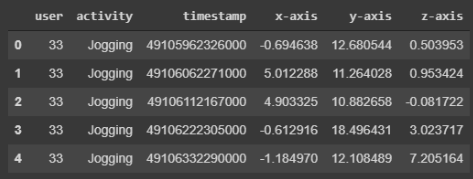
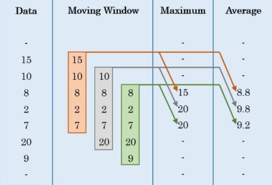
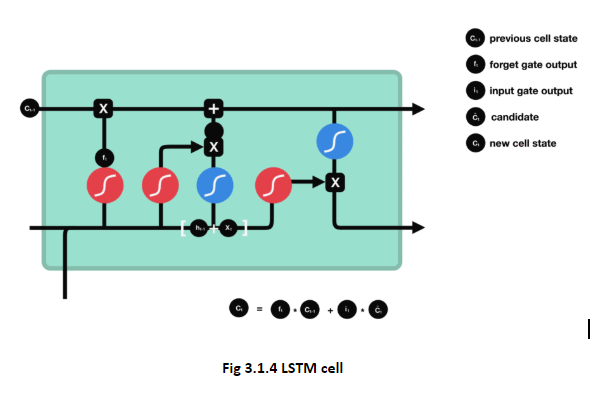
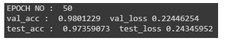

# HumanActiviyRecognition
An Android App to detect basic human activities like Standing, Sitting, Walking, Jogging, Upstairs, Downstairs. It Uses deep learning technique LSTM network to predict these activities from accelerometer sensor data.

* ### Dataset : WISDM lab dataset. ###

Dataset Preview:

It is accelerometer sensor data, you can see the readings of an accelerometer i.e, x,y,z axes data and also the class label is provided.
There are total six class labels : “sitting”, “standing”, “walking”, “jogging”,” upstairs”,” downstairs”. 

* ### Feature Engineering ###
From the sensor data we have as it is time series data, we have 2 options making statistical features out of it or else use sliding window technique.
As there exists some delay in making statistical features in runtime. It's better to using raw sliding window. I've used sliding window of size 200.

Sliding Window Example:

* ### Model Description ###
As data is timeseries data , I've used LSTM network to do the job. Adam optimizer, crossentropy loss function, 2 lstm layers.
After training model is freezed as .pb or protobuff format file. which can be deployed in an android application.

Lstm image:

* ### Results ###

* ### App Screenshot ###

I've used TensorflowInferenceInterface class to use our pretrained model on the inputs that we provide in the real time. For this interface we need to add                        lib-tensorflow_inference_java library into the project of the app, this library contains required classes and packages of TensorFlow to perform our classification.

